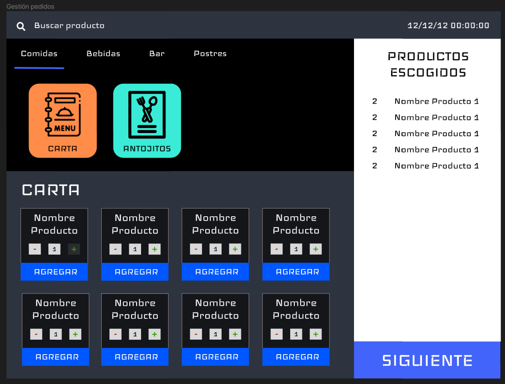
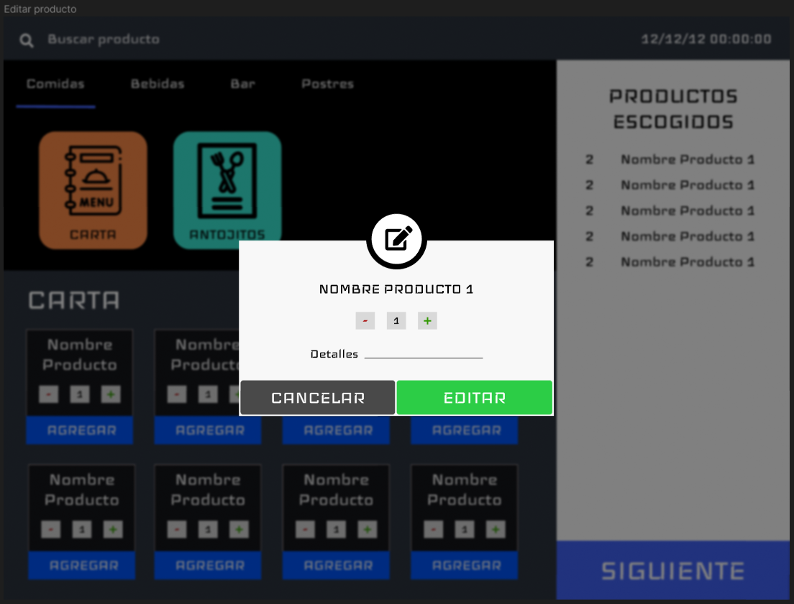
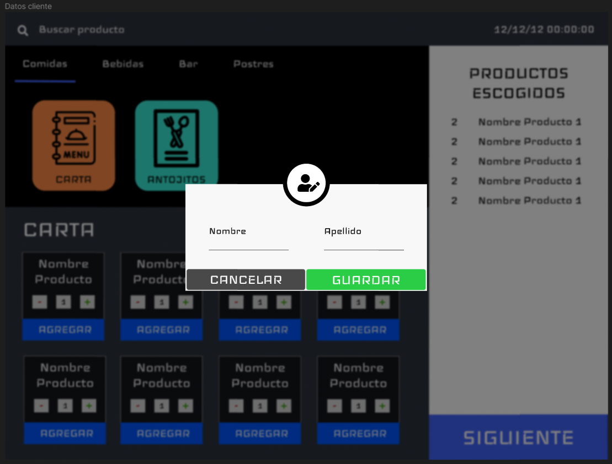
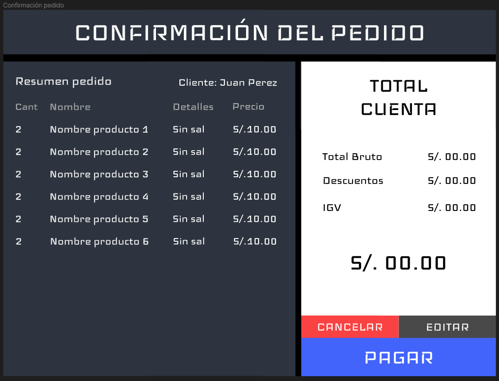
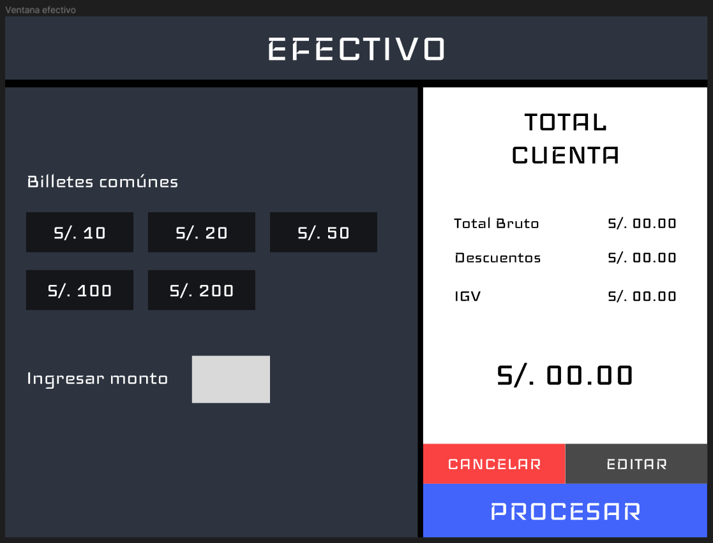
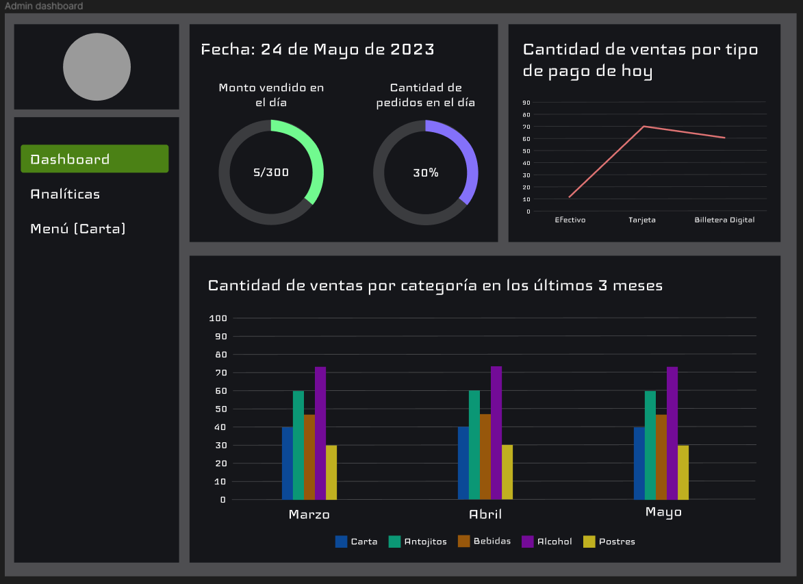
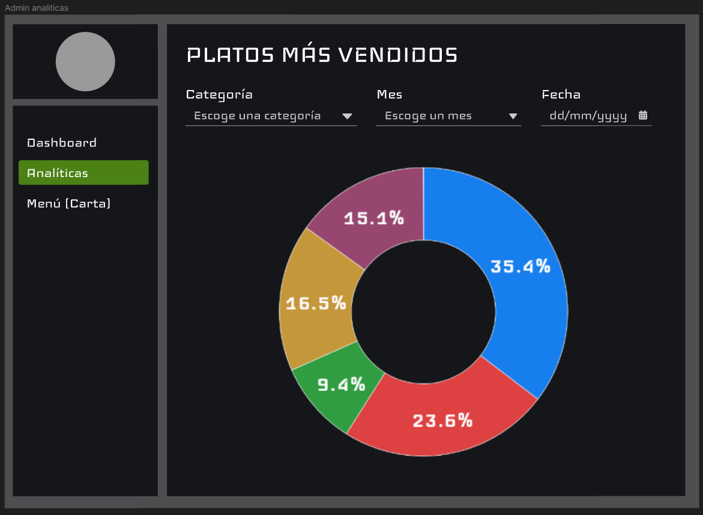
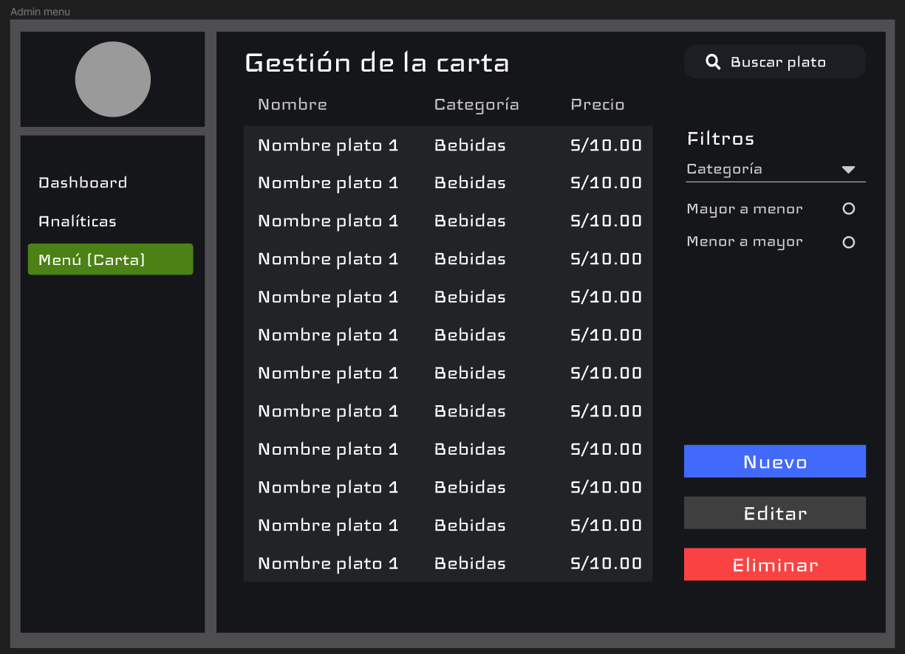

# Point of Sale and Administrative Management System for La Cochera Restaurant
This project is a point of sale and administrative management application for La Cochera restaurant developed in Java Swing.

## Overview
The application follows the Model-View-Controller (MVC) software architecture pattern and has an object-oriented approach. The application consists of 2 main parts:

- Point of Sale (POS): This part of the application is used to record sales and generate sales tickets. It is designed to be used by the restaurant employees.
- Administration Panel: This part of the application is used to manage dishes and view sales reports. It is designed to be used by the restaurant administrator.

## Requirements
Java (version 17 or higher)

## Application Views
Some designs may not match those in the final application, as minimal changes have been made to the application design, but the general idea remains the same.

### Point of Sale

### Administration Page

## Installation
1. Clone this repository
2. Navigate to src/main/java/
3. Run "LaCocheraPOSApplication.java" to start the application

## Usage
Under construction...
