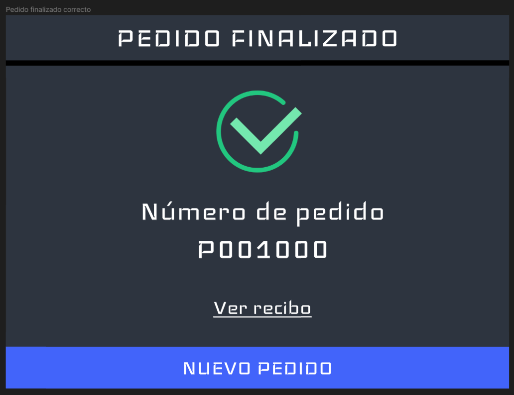

# Sistema de Punto de Venta y Gestión Administrativa para el restaurante Pollo Loco
Este proyecto es una aplicación de punto de venta y gestión administrativa para el restaurante Pollo Loco desarrollada en Java Swing.

## Descripción general
La aplicación sigue el patrón de arquitectura de software Modelo‑Vista‑Controlador (MVC) y tiene un enfoque orientado a objetos. La aplicación consta de 2 partes principales:

- Punto de Venta (POS): Esta parte de la aplicación se utiliza para registrar ventas y generar tickets. Está pensada para que la utilicen los empleados del restaurante.
- Panel de Administración: Esta parte de la aplicación se utiliza para gestionar platillos y ver reportes de ventas. Está pensada para el administrador del restaurante.

## Requisitos
Java (versión 17 o superior)

## Vistas de la aplicación
Algunos diseños pueden no coincidir con los de la aplicación final, ya que se han realizado cambios mínimos, pero la idea general se mantiene.

### Punto de Venta

### Página de Administración

## Instalación
1. Clona este repositorio
2. Navega a src/main/java/
3. Ejecuta "PolloLocoPosApplication.java" para iniciar la aplicación

## Uso
En construcción...
